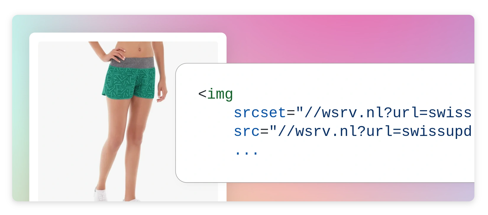

# Swissup_Wsrv

Swissup_Wsrv — is a Magento image optimization module that uses free
[wsrv.nl](https://wsrv.nl/) service to resize and convert images to webp format.

<picture>
    <source media="(prefers-color-scheme: dark)" srcset="./media/dark.webp">
    
</picture>

## Installation

```bash
composer require swissup/module-wsrv
bin/magento module:enable Swissup_Wsrv
```

## How it works

> [!IMPORTANT]
> Since [wsrv.nl](https://wsrv.nl/) will serve your images, your site must
> be accessible for the service.
> Eg. no `.htaccess` restrictions, no locally served domains or IP addresses.

The module replaces all image links with the links to wsrv.nl:

```html
<!-- Before -->


<!-- After -->

```

That's all. The rest of the job is handled by [wsrv.nl](https://wsrv.nl/).
